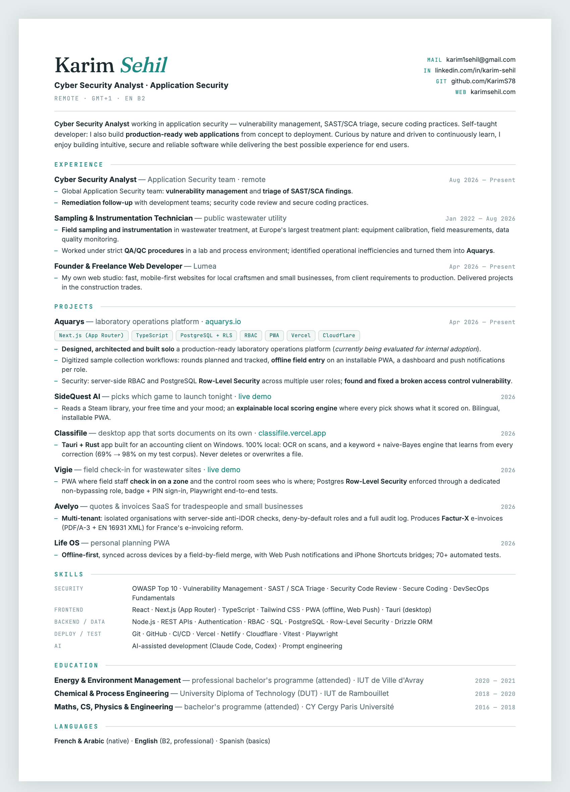

# CV — Karim Sehil

My CV as **one HTML file**. No template engine, no build step to read it:
open `index.html` in a browser, print it, and you get a one-page A4 PDF.

**Read it online:** https://karims78.github.io/cv/

<p align="center">
  
</p>

## Why HTML

- **One source of truth.** The PDF I send out is printed from this file, so the
  two never drift apart.
- **Diffable.** Every change to my CV is a readable git diff, not a new
  `CV_final_v3.docx`.
- **Print-first CSS.** The page is laid out in millimetres for A4 (`@page`,
  exact colours); on screen the same sheet is simply shown on a desk.

## Private details stay out of the repo

My phone number and employer names are not in `index.html`. They live in a
git-ignored `private.js`; on a local copy where that file is present the page
fills them in, otherwise (and always on the hosted page) it renders this public
version.

```bash
cp private.example.js private.js   # then edit it
```

Add `?public` to the URL to preview the public version even with `private.js`
in place.

## Build the PDF

```bash
./build.sh           # CV_Karim_Sehil_EN.pdf, with private details if present
./build.sh public    # public PDF + preview.png for this README
```

Uses headless Chrome (`CHROME=/path/to/chrome ./build.sh` to point at another
binary). PDFs are git-ignored.

## Files

| File | What it is |
|---|---|
| `index.html` | The CV: markup, print CSS, and the short script that applies private details |
| `private.example.js` | Template for the git-ignored `private.js` |
| `build.sh` | PDF and preview generation |
| `preview.png` | The public version, as rendered by `./build.sh public` |

## Contact

- Portfolio: https://karimsehil.com
- LinkedIn: https://www.linkedin.com/in/karim-sehil
- GitHub: https://github.com/KarimS78
